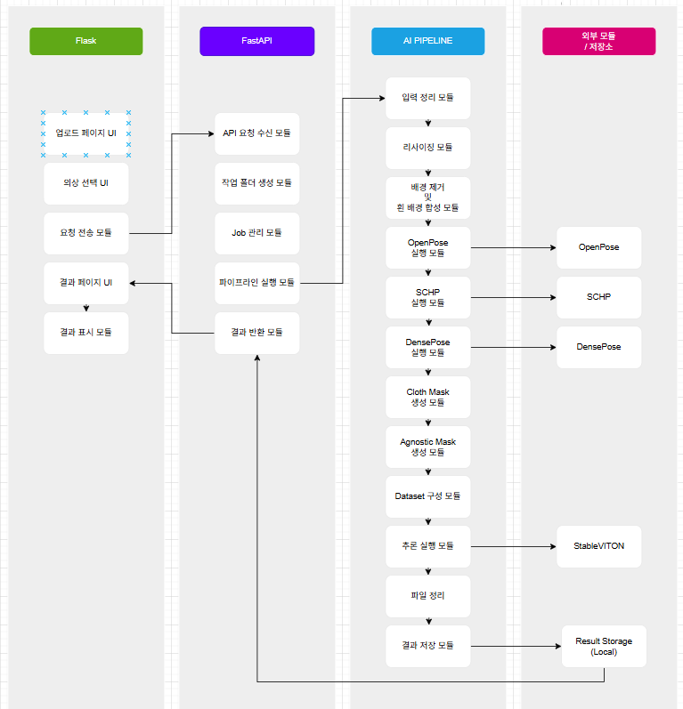

# Virtual Fitting Pipeline

## 프로젝트 소개
본 프로젝트는 사용자가 사람 이미지와 의상 이미지를 입력하면, 가상 피팅 결과를 생성하는 **Virtual Try-On System**입니다.

시스템은 다음과 같은 구조로 구성됩니다.

- **React**: 사용자 인터페이스 제공
- **FastAPI**: 요청 처리 및 파이프라인 실행 제어
- **StableVITON Pipeline**: 전처리 및 추론 수행
- **OpenPose / SCHP / DensePose**: 외부 전처리 모듈

최종적으로 사용자는 웹 환경에서 이미지를 업로드하고, 가상 피팅 결과를 확인할 수 있습니다.

---

## 프로젝트 정보

- **프로젝트 기간:** 2026.03.06 ~ 2026.03.19
- **프로젝트 목표:** 가상 의류 피팅 시스템 구현

---

## 시스템 구성도



본 프로젝트는 Flask 기반 프론트엔드, FastAPI 기반 백엔드, StableVITON 기반 AI 파이프라인으로 구성됩니다.  
프론트엔드는 사용자 입력과 결과 화면을 담당하고, 백엔드는 요청 처리와 작업 실행을 담당하며, AI 파이프라인은 전처리와 가상 피팅 추론을 수행합니다.

---

## 파이프라인 개요

가상 피팅 파이프라인은 아래 순서로 진행됩니다.

1. 입력 이미지 정리
2. 리사이즈
3. 배경 제거 및 흰 배경 합성
4. OpenPose 실행
5. SCHP 실행
6. DensePose 실행
7. Cloth Mask 생성
8. Agnostic Mask 생성
9. StableVITON 입력 데이터셋 구성
10. StableVITON inference 실행

---

## 프로젝트 구조

```text
virtual-fitting-pipeline/
├─ README.md
├─ docs/
│  └─ images/
├─ StableVITON/
│  ├─ README.md
│  └─ pipeline/
├─ openpose/
│  └─ README.md
├─ detectron2/
│  └─ README.md
├─ backend/
│  └─ README.md
├─ frontend/
│  └─ README.md
└─ Self-Correction-Human-Parsing/
   └─ README.md
```
---

## 참고 사항
- 외부 프로젝트 원본 코드는 저장소에 포함하지 않았습니다.
- 각 외부 모듈은 별도로 설치 후 사용해야 합니다.
- 경로 및 환경 설정은 각 폴더 README를 참고해주시길 바랍니다.

---

## 팀원 소개

<table>
  <tr>
    <td align="center">
      <a href="https://github.com/Bl00mingdays">
        
        <br />
        <sub><b>Bl00mingdays</b></sub>
      </a>
      <br />
      Kim Hyunwoo
    </td>
    <td align="center">
      <a href="https://github.com/qkrrkdtj">
        
        <br />
        <sub><b>qkrrkdtj</b></sub>
      </a>
      <br />
      Park Kangseo
    </td>
    <td align="center">
      <a href="https://github.com/wmh7539">
        
        <br />
        <sub><b>wmh7539</b></sub>
      </a>
      <br />
      Wee Ohyune
    </td>
    <td align="center">
      <a href="https://github.com/dongim-02">
        
        <br />
        <sub><b>dongim-02</b></sub>
      </a>
      <br />
      Han Dongim
    </td>
  </tr>
</table>

---

## 기술 스택

### 프론트엔드 / 백엔드
- React
- FastAPI

### AI / 컴퓨터 비전
- PyTorch
- OpenCV

### 실행 환경
- Conda
- WSL Ubuntu

## AI 모델 / 외부 모듈

- StableVITON
- OpenPose
- SCHP
- Detectron2 / DensePose

---
