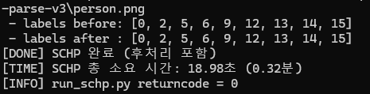

# Self-Correction-Human-Parsing (SCHP)

## 1. 개요

이 폴더는 StableVITON 전처리 과정에서 사용하는 SCHP(Self-Correction Human Parsing) 환경에 대한 설명을 정리한 폴더입니다.

본 프로젝트에서는 사람 이미지에서 human parsing map을 생성하기 위해 SCHP를 사용했습니다.

이 저장소에는 SCHP 원본 코드를 포함하지 않았으며, 별도로 설치한 후 사용했습니다.

---

## 2. 역할

SCHP는 사람 이미지의 의상, 팔, 다리, 얼굴 등 인체 및 의복 영역을 픽셀 단위로 분할하는 human parsing 모델입니다.

본 프로젝트에서는 StableVITON 전처리 과정에서 필요한 parsing map을 생성하기 위해 SCHP를 사용했습니다.

생성된 parsing 결과는 이후 마스크 생성 및 추론 입력 구성 과정에서 사용했습니다.

---

## 3. 사용 환경

- WSL Ubuntu
- Conda 환경 사용
- 환경 이름 예시: `schp`

본 프로젝트의 파이프라인에서는 SCHP를 **WSL 환경에서 실행**하도록 구성했습니다.

---

## 4. 사용 목적

StableVITON 전처리 과정에서는 사람 이미지에 대한 parsing 정보가 필요합니다.

초기에는 CIHP 기반 방식을 고려했지만, 전처리 시간 문제와 환경 구성 문제로 인해 SCHP 기반 방식으로 변경했습니다.

SCHP를 사용한 이유는 다음과 같습니다.

- GPU 환경에서 실행 가능
- 기존 CIHP 방식보다 전처리 과정 구성에 유리
- StableVITON 입력 구성에 필요한 parsing 결과를 생성할 수 있음

---

## 5. 필요한 구성

SCHP를 사용하기 위해 아래 항목이 필요합니다.

- `simple_extractor.py`
- `checkpoints/exp-schp-201908261155-lip.pth`

즉, SCHP 실행 코드와 체크포인트 파일이 모두 준비되어 있어야 합니다.

---

## 6. 프로젝트 내 사용 방식

SCHP는 파이프라인 내부의 `run_schp.py`를 통해 호출합니다.

실행 흐름은 다음과 같습니다.

1. 사람 이미지 준비
2. `run_schp.py` 실행
3. SCHP를 통해 parsing 결과 생성
4. 기존 'CIHP_PGN'을 통해 생성하던 parse map와 같도록 후처리
5. 생성된 parsing 결과를 StableVITON 전처리 과정에 사용

사용자는 일반적으로 SCHP를 직접 실행하기보다, 메인 파이프라인 실행 시 자동으로 SCHP가 실행되도록 사용했습니다.

---

## 7. 경로 설정

SCHP 경로와 환경 이름은 `StableVITON/pipeline/config.py`에서 설정합니다.

예시:

```python
SCHP_ROOT = Path(r"C:\path\to\Self-Correction-Human-Parsing")
SCHP_CONDA_ENV = "schp"
```

## CIHP_PGN vs SCHP

기존 CIHP 기반 human parsing 방식과 SCHP 방식을 비교한 결과, 유사한 label 결과를 유지하면서도 SCHP가 훨씬 빠른 처리 속도를 보였습니다.

### CIHP_PGN


### SCHP


위 비교에서 SCHP는 기존 CIHP_PGN 대비 더 짧은 시간 안에 parsing 결과를 생성할 수 있었으며, 실제 파이프라인에서는 SCHP 기반 전처리로 변경했습니다.